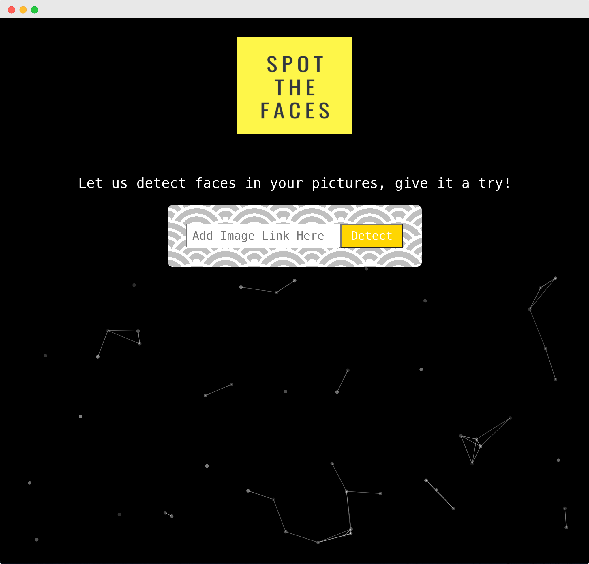
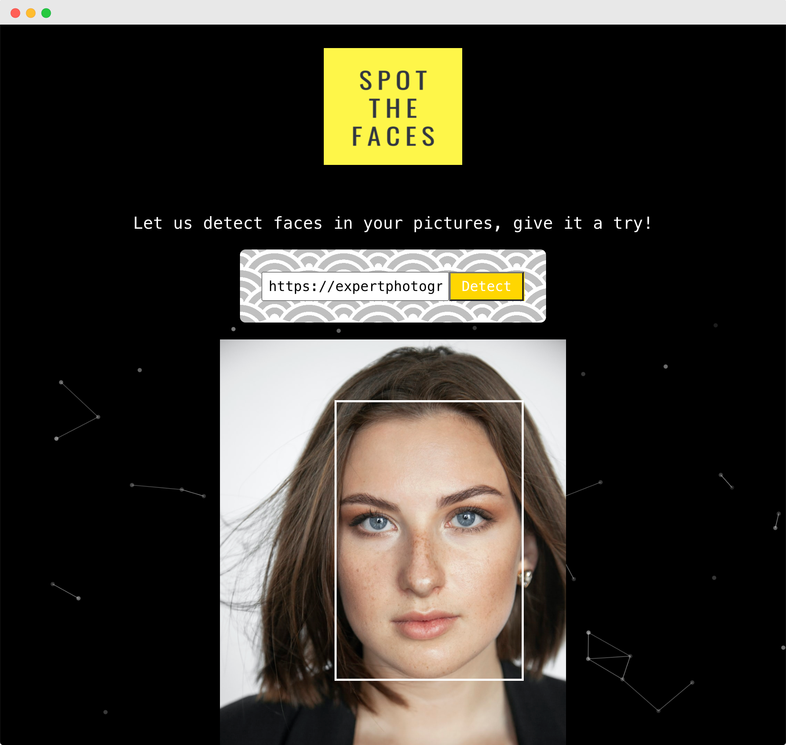
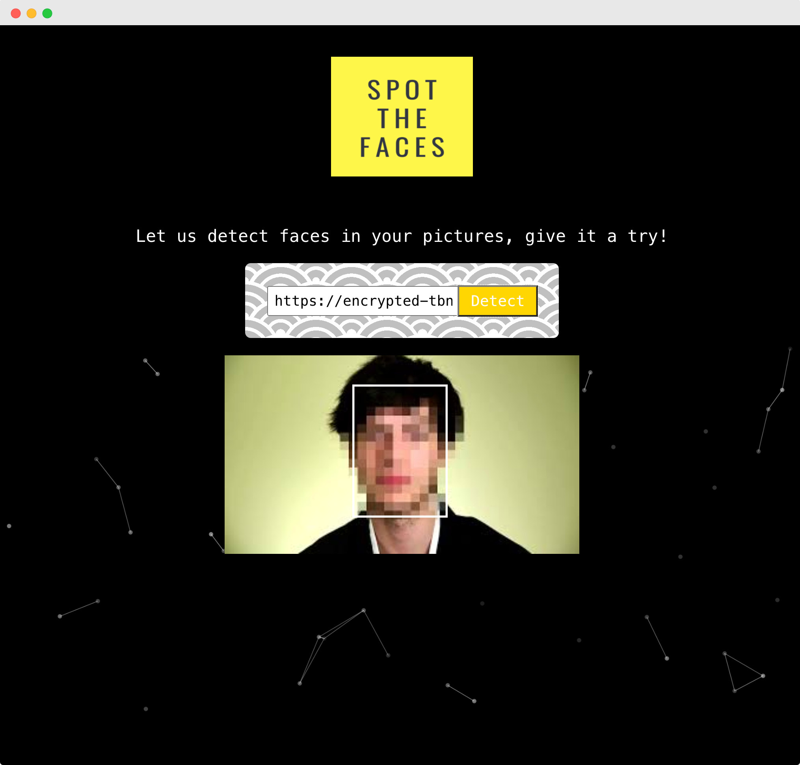
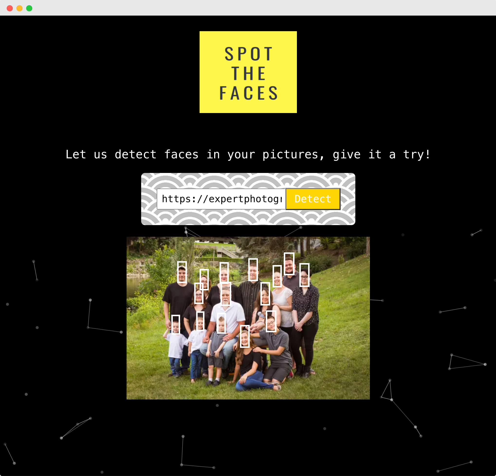

> An online library for programming tutorials. 

## Table of Contents
- [About](#about)
- [Features](#features)
- [Tech Stack](#tech-stack)
- [Planning](#planning)
- [Screenshots](#screenshots)
- [Getting Started](#getting-started)
- [Next Steps](#next-steps)
- [Installations](#installation)

## About 
React Project that uses the Clarifai face detection API, which returns coordinate locations of where faces would appear within an image. You can use this web app to input a link to an image to identify a face by marking the face with a white border box.

## Features
- Identify multiple faces in a photo and mark them with a white border box.

## Tech Stack
- HTML + CSS
- React
- Tachyons for styling
- Particles.js for background animation
- Tilt for logo Animation

## Planning
- [Wireframes]()

## Screenshots

## Getting Started 
Click [here](https://spotthefaces.netlify.app/) to view a demo 

## Next Steps
- Allow users to upload a photo and identify faces
- Allow users to log in and saved previously identified faces
- Allow users to cover idenitifed faces with emojis of choice

## Installation
1. Run ``npm install`` to install dependencies 
2. Run `npm start` for client-side server
3. Go to localhost:3000 in the browser
